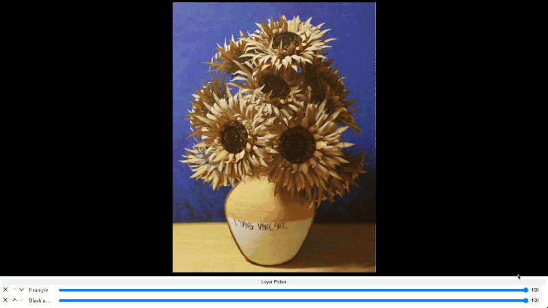
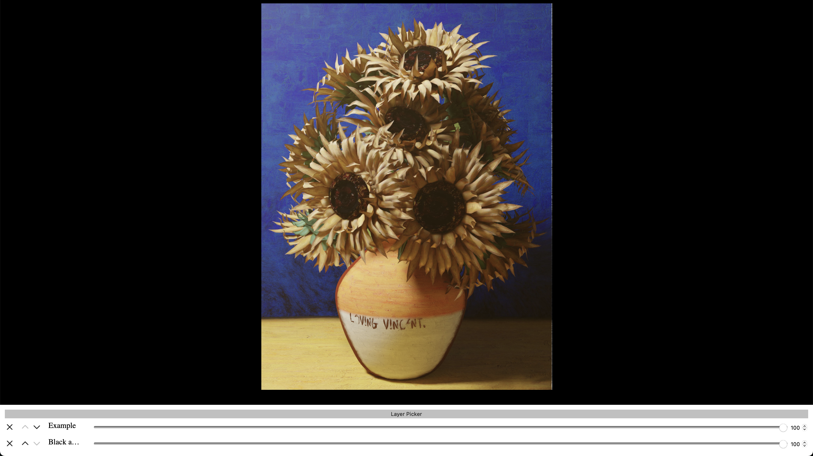
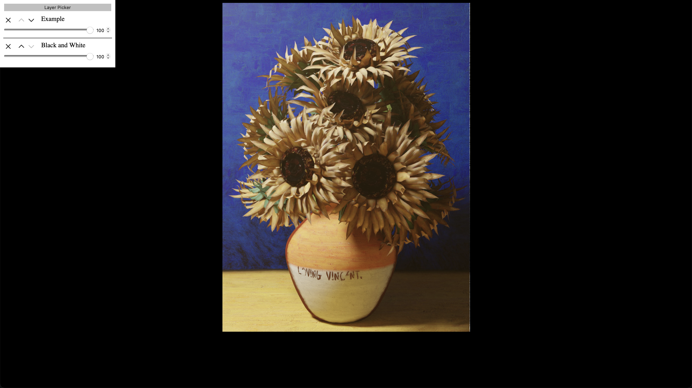
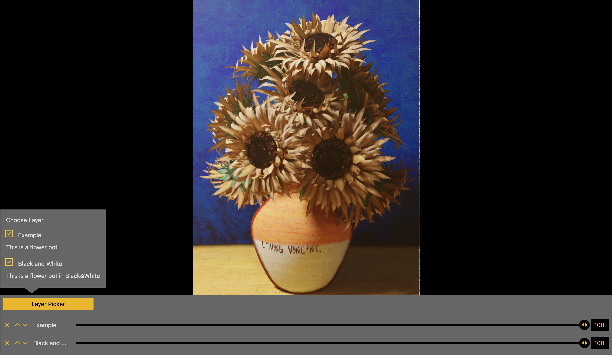

# openseadragon-opacity-slider
> This plugin/repository is under **active** development! Planned release is end of march! 

This plugin adds the functionality to adjust the transparency of superimposed images to [OpenSeaDragon (OSD)](https://openseadragon.github.io) in the GUI, as well as to adjust their order.
This can be useful for comparing different maps of the same place, satellite-imagery with different recording dates, images of art captured with different techniques.


You can try out a demo [here](https://wasmachensachen.github.io/openseadragon-opacity-slider/).

## Requirements
OpenSeaDragon (OSD) > v.3.0.0

## Glossary
For a better understanding of the plugin, here are some terms, which we will use in this documentation:
- **Layer:** Due to the reason that we put several images on top of each other, we don't talk about images anymore, but about layers. An image thus represents a layer.
- **Layername:** The layername represents the designation of a layer, which can be, for example, the recording date or the recording technique.
- **Layernameexplanation:** The layernameexplanation are additional informations for the user about the layer.
- **Slider:** Each visible layer has a slider to manipulate it. Without any additional [settings](#options) a slider consisits of a removal-button, up- and down-buttons for the layerorder, a range slider and a number-input for changing the opacity. So a slider is not only the range input.
- **Sliderarea:** The sliderarea is the space where all the sliders live.
- **Layerpicker:** The layerpicker is an additional area where all layers are listed and can be toggled. Also there the layernameexplanation is shown.

## Installation
If not already done install OSD as described in the [OSD installation guide](https://openseadragon.github.io/#download).
After that, you can install the Plugin in multiple ways: 
### 1. Via npm/yarn/pnpm
Use the installation-script for your prefered package manager from below:

npm: `npm install openseadragon-opacity-slider` or `npm i openseadragon-opacity-slider`

yarn: `yarn add openseadragon-opacity-slider` 

pnpm: `pnpm add openseadragon-opacity-slider` 

After that import it into your JS-File:

```js
import "openseadragon-opacity-slider"
```

> If you use this option you have to add `type="module"` to your script-tag in your HTML-file.

### 2. Use a CDN:
Import one of this CDN-links in your HTML-file:

jsDelivr: 
```html
<script src="https://cdn.jsdelivr.net/npm/openseadragon-opacity-slider/dist/openseadragon-opacity-slider.min.js"></script>
```

unpkg:
```html
<script src="https://unpkg.com/openseadragon-opacity-slider/dist/openseadragon-opacity-slider.min.js"></script>
```

bundle.run: 
```html
<script src="https://bundle.run/openseadragon-opacity-slider"></script>
```

> This will always provide the latest version. If you want to use a special version change the following part of the url from `openseadragon-opacity-slider` to `openseadragon-opacity-slider@X.X.X`.

### 3. Via download 
Download the Plugin [here](https://github.com/WasMachenSachen/openseadragon-opacity-slider/archive/refs/heads/main.zip) and move it into your project directory. For size reasons only copy the `dist`- and the `styles`-folder.
And import it into your JS- or HTML-File:
```js
import "<RELATIVE_PATH_TO_DIST>/dist/openseadragon-opacity-slider.min.js"
```
> If you use this option you have to add `type="module"` to your script-tag in your HTML-file.

 **OR**
```html
<script src="<RELATIVE_PATH_TO_DIST>/dist/openseadragon-opacity-slider.min.js"></script>
```

## Setup and Usage
1. Setup OSD, if already done go to 3. 

Add div for OSD to your html:
```html
<!-- ... -->
  <div id="openseadragon"></div>
<!-- ... -->
```

2. Create a new OSD-object in your JS and add images (which will become the layers):
```js 
const viewer = OpenSeadragon({
  id: "openseadragon",
});

// Tiled image: 
viewer.addTiledImage({
  tileSource: "<YOUR_TILE_SOURCE>",
  opacity: <START_OPACITY>,
  // More options go here
});

// Simple image:
viewer.addSimpleImage({
  url: "<YOUR_IMAGE_SOURCE>",
  opacity: <START_OPACITY>,
  // More options go here
});
```
> If no opacity is given the layer will have the default OSD opacity of 100% (or 1).

3. Setup the additional information of the layers:
```js 
const layerInformation = [
  {
    layerName: "<NAME_OF_THE_LAYER>",
    layerNameExplanation: "<EXPLANATION_OF_THE_LAYER>",
    source: "<YOUR_SOURCE>", // This has to be the same source as in the previous step!
    hidden: <false|true>,    // If true, the image is hidden by default and only availible in the layerpicker 
  },
  // One object for each layer
]
```
Please note, that it's currently **not** possible to add the same image (source) multiple times.

3. Setup the [options](#options) for the layers:
```js
const osdosOptions = {
  // Options can go here
}
```

4. Add the plugin to the viewer:
```js
viewer.opacityslider({ ...osdosOptions, layerInformation });
```

If everything is right there should be a basic sliderarea below the OSD-viewer. Now you can style the sliderarea and sliders like described [here](#styling) or change the options like described [below](#options).

## Options
You can set multiple options in your options-object to manipulate the output of the sliderarea. These are all optional and fallback to the default if not defined.
| Option | Type | Default | Explanation | Additional information|
|---|---|---|---|---|
| `showLayerPicker` | Boolean | true | If true, the layerpicker will be displayed | - |
| `showRangeSlider` | Boolean | true | If true, the rangeslider will be displayed | If this and `showNumberInput` are false the user can't change the opacity!  |
| `showNumberInput` | Boolean | true | If true, the numberinput will be displayed | If this and `showRangeSlider` are false the user can't change the opacity!  |
| `showRemove` | Boolean | true | If true, the removebutton will be displayed | This only toggles the remove-button. The user can still hide the layers in the layerpicker. |
| `showLayerInformation` | Boolean | true | If true, the layerinformation will be displayed in the layerpicker. | - |
| `showSliders` | Boolean | true | If true, the sliderarea will be displayed.  | If set to false you probably don't need the plugin ;) |
| `layerPickerHeading` | String | Choose layers:  | Heading for the Layerpicker | - |
| `layerPickerButtonText` | String | Layer Picker | Buttontext for the button which toggles the layerpicker | - |
| `sortable` | Boolean | true | If true, the up- and down-buttons are displayed | - |
<!-- Blueprint for new Rows: | `` |   |   |   |   | -->

## Styling
For styling you have two options:

### 1. Predefined stylesheets
If you want it simple you can use one of our predefined stylesheets. Right now this stylesheet is availible:
- `Minimal`: This is the most basic styles you can use. Pretty clean in Black and white.

- `Minimal-Side`: Also basic styles but they are in a sidebar instead of below the viewer. 

- `Black & Yellow`: Another theme with some colors in black, yellow and gray. And some custom styled range sliders.

- More are coming soon! We are working on sweet colourful styles.

Just import one into your HTML-document with the following link-tag..
#### ...when you used a packagemanager:
In your JS-File:
```js
import "openseadragon-opacity-slider/styles/<NAME_OF_THE_SHEET>.css";
``` 

#### ...when you used a CDN:
```html
<!-- ... -->
  <link rel="stylesheet" href="<CDN_URL>/styles/<NAME_OF_THE_SHEET>.css">
<!-- ... -->
``` 
Replace `<CDN_URL>` with one of these:
- `https://cdn.jsdelivr.net/npm/openseadragon-opacity-slider`
- `https://unpkg.com/openseadragon-opacity-slider`
- `https://bundle.run/openseadragon-opacity-slider`
(If you want a special version it's the same like described [here](#2-use-a-cdn))

#### ...when you used the download:
```html
<!-- ... -->
  <link rel="stylesheet" href="<RELATIVE_PATH_TO_STYLES_FOLDER>/styles/<NAME_OF_THE_SHEET>.css">
<!-- ... -->
``` 

### 2. Build your own stylesheet
If you are not satisfied with the predefined stylesheets or want to customize it more to your styleguide you can create your own stylesheet. For this we have added classes to all elements. 
<!-- TODO: add file and link! -->
> TBD. Here you find a blueprint and more explanation soon.
<!--In [style-blueprint.css](#) you find all classes you can use for styling. In addition, we have added comments describing on which elements this class owns.

If you want to share your stylesheet with others, feel free to open a [pull request](https://github.com/WasMachenSachen/openseadragon-opacity-slider/pulls)!-->

## Team and Contribution
This plugin is developed and maintained by the following team members:
 - [@WasMachenSachen](https://github.com/WasMachenSachen) | Tim Loges
 - [@BenediktEngel](https://github.com/BenediktEngel) | Benedikt Engel
 - [@Masch229](https://github.com/Masch229) | Marius Scherff
 - [@SickxX](https://github.com/SickxX) | Christopher Toth


### Contribute
<!-- Maybe something about dev-server and build stuff with npm and vite  -->
If you want to contribute feel free to build something, but give your best to follow the following steps:

1. Create a new branch with the `dev`-branch as base. Please consider a good and self-descriptive name for your branch.
2. Now you can build stuff.
3. For your commit-messages please use the [conventional commits syntax](https://www.conventionalcommits.org/en/v1.0.0/#specification).
4. If everything is done open a pull request onto the `dev`-branch; we will look into it and when everything is fine it will get merged. 
5. Your changes will be merged into the `main`-branch with the next version!

## MISC

**Licence:** [BSD-3](./LICENSE)

**Problems?** Please open an [issue](https://github.com/WasMachenSachen/openseadragon-opacity-slider/issues), maybe we can help.

**Roadmap:** 

- Add functionality for adjusting the position of a layer in x- and y-direction.
- More stylesheets with different styles. *You have developed a stylesheet and want to share it with others? Feel free to [open](https://github.com/WasMachenSachen/openseadragon-opacity-slider/pulls) a pull request!*
- *Are we missing something you would want? Feel free to [open](https://github.com/WasMachenSachen/openseadragon-opacity-slider/issues) an issue and describe it.*


**Additional Information:** This repository/project is the result of a module in the [Media Informatics Master course](https://www.medieninformatik.th-koeln.de) at [TH Köln](https://www.th-koeln.de). We are doing our best to maintain this project. If you have any wishes, suggestions or questions, please write an [issue](https://github.com/WasMachenSachen/openseadragon-opacity-slider/issues).
